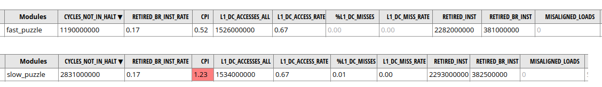

As part of exercise 2.4, I marked the `incr` variable as `volatile` in the following loop:

```cpp
static const int kIterations = 1000 * 1000000;
uint64_t sum = 0;
/*volatile added here*/ volatile int incr = ...; // the value of incr doesn't matter

for (int i = 0; i < kIterations; ++i) {
	sum += incr;
}
```

Compiling this with `-O0` resulted in a **≈2.5x** increase in the number of CPU cycles consumed by the loop compared to the `volatile`-less version.

There could be dozens of plausible reasons behind this, so initially I didn't think much of it. However, inspecting the disassembly revealed that both versions compiled to almost identical code. The only change was the order of `i` and `incr` on the stack.

More precisely, when `volatile` is absent, `i` is stored at `[rbp-0x30]`, and `incr` is at `[rbp-0x2c]`. After adding `volatile`, the locations of `i` and `incr` are swapped.

(if you wonder why the variables are spilled to the stack in the first place, remember it's an `-O0` build)

The slowdown was easily reproducible, so I couldn't shrug this off as some fluke. I started ruling out the possible suspects:
  * both programs computed the same result
  * they both ran at the same CPU frequency, and the wall times were consistent with the number of cycles
  * no other process was using the CPU core (or its logical sibling) the programs were running on
  * both `incr` and `i` comfortably fit in the L1 data cache in both programs, so the number of L1d accesses was essentially equal to the number of memory accesses, and the number of L1d misses was essentially zero
  * the programs were of exactly the same size and the layout of code/data was exactly the same, which excluded weird loop alignment issues

None of this made any sense to me. Both programs executed the same straightforward single-threaded loop with one addition, two loads, and one store, but one of them was running circles around the other.

Since my CPU was an `AMD Ryzen 3970X`, I eventually resorted to running [AMD μProf](https://developer.amd.com/amd-uprof/) and looking at every possible performance counter I could find. I failed to find any discernible difference. This is a small subset of the counters I tried that, as far as I can see, says "these programs behave identically, except that the one at the bottom wastes significantly more CPU cycles":



In desperation, I distilled the full-blown C code into a small, self-contained [assembly program](https://github.com/dfyz/understanding_software_dynamics/blob/master/mystery1_24_amd_puzzler/amd_puzzler.s) and started tinkering randomly, trying to figure out what makes slowdown go away. I observed the following facts, which are not that useful but moderately interesting:
  * The C code stored `i` and `incr` as 32-bit variables, extending them with `cdqe` when appropriate. For simplicity, I switched to 64-bit variables. The problem persisted.
  * The `sum` variable was also spilled to the stack. I moved it to a register, the problem persisted.
  * Changing `add [...], 1` to `inc [...]` also didn't change anything.
  * I strated accessing the variables directly with `[rsp + X]` instead of propertly tracking `rbp` and using `[rbp - X]`. The problem persisted.

At this point, I began playing with stack offsets, and this is where some curious patterns finally started to emerge:
  * The slowdown happens only when then the stack *offset* (i.e., `0x30` in `[rbp-0x30]`) of `i` is **not** divisible by `8`. The absolute value of the offset and the actual address of `i` can be arbitrary.
  * The offset and address of `incr` are irrelevant. That is, if the stack offset of `i` *is* divisible by `8`, there is no slowdown.
  * On every loop iteration, `i` is first [modified](https://github.com/dfyz/understanding_software_dynamics/blob/a92476c7f999730c8ea0454635b324e0bf68f65c/mystery1_24_amd_puzzler/amd_puzzler.s#L47) in memory with `++i` (`inc [...]`), and then [loaded](https://github.com/dfyz/understanding_software_dynamics/blob/a92476c7f999730c8ea0454635b324e0bf68f65c/mystery1_24_amd_puzzler/amd_puzzler.s#L49) from memory again for `i < kIterations` (`cmp [...], 999999999`).

Finally, with a little help from my friends and their hardware, I discovered something amazing: *the slowdown only happens on AMD Zen 2 processors*! Both programs have the same speed when run on AMD Zen 3 or Intel CPUs (unfortunately, I couldn't get my hands on a Zen 1).

Example output on AMD Zen 2:

```
$ ./test_amd_puzzler.sh
Model name:                      AMD Ryzen Threadripper 3970X 32-Core Processor
FAST VERSION (bin size = 9200)
cycles = 2392617802
result = 42000000000
SLOW VERSION (bin size = 9200)
cycles = 6092499439
result = 42000000000
```

Example output on AMD Zen 3:

```
$ ./test_amd_puzzler.sh
Model name:                      AMD Ryzen 7 5800HS with Radeon Graphics
FAST VERSION (bin size = 9248)
cycles = 1695570624
result = 42000000000
SLOW VERSION (bin size = 9248)
cycles = 1692961866
result = 42000000000
```

Example Intel output:

```
$ ./test_amd_puzzler.sh
Model name:          Westmere E56xx/L56xx/X56xx (Nehalem-C)
FAST VERSION (bin size = 9352)
cycles = 6752197154
result = 42000000000
SLOW VERSION (bin size = 9352)
cycles = 6722025261
result = 42000000000
```

Based on this, I strongly suspect that the fast version of the program hits the obscure undocumented Zen-2-only feature Anger Fog [found](https://www.agner.org/forum/viewtopic.php?f=1&t=41) a couple of years ago. He [calls](https://www.agner.org/optimize/microarchitecture.pdf) it "Mirroring memory operands" (see section 21.18). Essentially, under some conditions, the CPU allows you to perform successive store/load/RMW instructions operating on the same memory address with zero latency (instead of ). One of these conditions goes like this:

> The memory address may have an index register, a scale factor, and an offset. The offset must be divisible by 4 in 32 bit mode, and *by 8 in 64 bit mode*.

Sounds really familiar! In other words, it's not that the slow version is *unreasonably slow*. It's more like the fast version is *unreasonably fast*.

I'm still not 100% sure my explanation is correct, for two reasons:
  * Agner Fog says that another condition is that "the offset must be in the range -128 to +127 to fit into an 8-bit signed integer", but in my experiments, offsets as high as 1024 worked just fine.
  * He also says that the memory operand mirroring machinery is completely absent from Zen 3. However, the number of cycles in the output above for Zen 3 is so low there is a possibility that whatever makes the fast version go fast on Zen 2 might also apply to Zen 3 (although it doesn't depend on offsets being divisible by 8 anymore).

If anyone knows how to definitively find out what's going on, please do let me know! You can run your own experiments by modifying the [assembly](https://github.com/dfyz/understanding_software_dynamics/blob/master/mystery1_24_amd_puzzler/amd_puzzler.s) and then running the same [shell script](https://github.com/dfyz/understanding_software_dynamics/blob/master/mystery1_24_amd_puzzler/test_amd_puzzler.sh) I used to get the example outputs above.